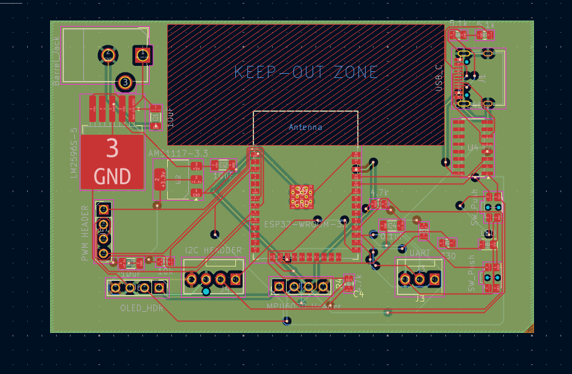
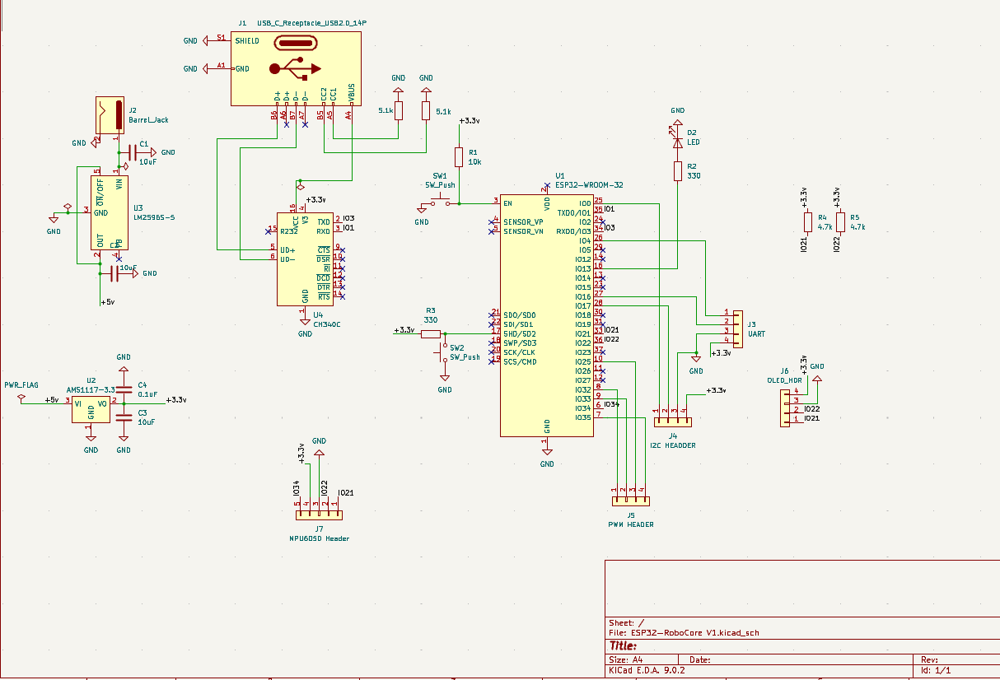
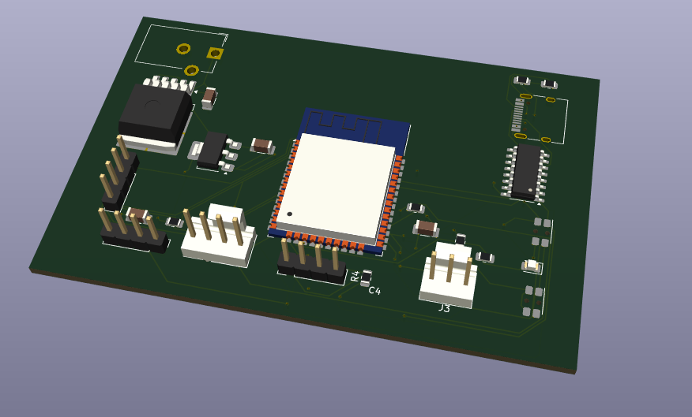
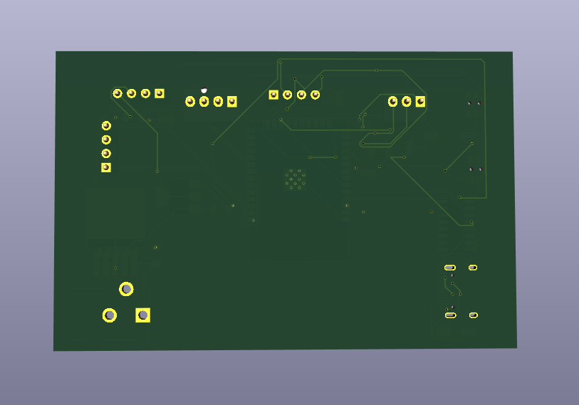

# ESP32-RoboCore V1

A custom-designed 4-layer development board based on the **ESP32-WROOM-32** SoC, tailored for robotics applications and modular sensor interfacing. This board includes onboard voltage regulation, USB-UART communication, and multiple headers for I²C, PWM, and more.

---

## 🧩 Features

- **Microcontroller:** ESP32-WROOM-32
- **Power Supply:**
  - 12V Barrel Jack input
  - LM2596S-5 (5V regulator)
  - AMS1117-3.3 (3.3V LDO regulator)
- **USB-UART:** CH340C IC with USB-C support
- **Modular Headers:**
  - I²C Header
  - PWM Header
  - MPU6050 IMU Header
  - OLED Display Header
- **Push Buttons:** 2 x Tactile switches
- **3.3V & 5V Rails**
- **PCB Type:** 4-layer custom PCB
- **Keep-Out Zone:** Defined for onboard ESP32 antenna

---

## 🖼️ Images

| PCB Preview | Circuit Diagram |
|-------------|------------------|
|  |  |

| 3D Front View | 3D Back View |
|---------------|---------------|
|  |  |

---

## 📁 Project Structure
```
ESP32-RoboCore-V1/
├── ESP32-RoboCore V1.kicad_pcb # PCB layout
├── ESP32-RoboCore V1.kicad_sch # Schematic
├── ESP32-RoboCore V1.kicad_pro # KiCad project file
├── Gerber Files/ # Gerber files for fabrication
├── Images/ # Preview images
│ ├── 3D-Back.png
│ ├── 3D-Front.png
│ ├── Circuit.png
│ └── PCB.png
└── README.md
```

---

## 📦 Gerber Files

The production-ready Gerber files are available in the `Gerber Files/` directory. These files were generated using **KiCad** and are ready to be uploaded to any PCB fabrication service (e.g., JLCPCB, PCBWay, etc.).

---

## 📚 Tools Used

- **Schematic & PCB Design:** KiCad
- **3D Model Rendering:** KiCad 3D Viewer
- **Microcontroller:** ESP32-WROOM-32

---

## 👨‍💻 Author

**Ujwal Kumar S**  
Electronics and Electrical Engineering  
[GitHub Profile](https://github.com/itsujwal20)

---

## ⚙️ License

This project is open-source under the [MIT License](LICENSE).
